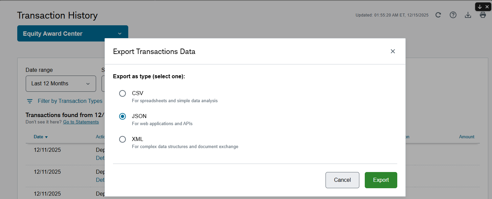

# Capital Gains Calculator

A comprehensive Python tool for calculating capital gains from stock sales, designed for Indian residents with investments in both foreign (US) and Indian markets. It computes capital gains in INR, applies proper tax rules, and generates detailed reports.

## Features

- **Multi-Source Support**: Processes transactions from:
  - Schwab Equity Awards Center (RSU, ESPP)
  - Schwab Individual Brokerage (regular trades)
  - Indian brokers:
    - Groww (stocks and mutual funds capital gains reports)
    - Zerodha (equity P&L reports)

- **Exchange Rate Handling**: Uses SBI TT Buy rates for USD-INR conversion with automatic fallback to nearest available date

- **Holding Period Classification**:
  - Foreign stocks: LTCG > 2 years, STCG ≤ 2 years
  - Indian equities: LTCG > 1 year, STCG ≤ 1 year

- **FIFO Matching**: Automatically matches sales with purchases using First-In-First-Out method for individual brokerage trades

- **Tax Calculation**: Computes tax liability with proper Indian tax rates and surcharges

- **Comprehensive Reports**:
  - Detailed transaction-wise report
  - Summary by source, type, and symbol
  - Quarterly breakdown for advance tax payments
  - Excel export with multiple formatted sheets

---

## Quick Start

```bash
# Install dependencies
pip install -r requirements.txt

# Run the calculator (auto-detects files in statements/ folder)
python main.py

# Run with taxes already paid
python main.py --taxes-paid 475000

# Or run the web app locally
streamlit run app.py
```

## 🌐 Web App

This calculator is available as a web application! You can:

1. **Use it online**: [Capital Gains Calculator on Streamlit](https://your-app.streamlit.app) *(replace with your deployed URL)*

2. **Run locally**:
   ```bash
   streamlit run app.py
   ```

3. **Deploy your own instance** on Streamlit Cloud (free) - see [Deployment](#deployment-to-streamlit-cloud) section below.

---

## Installation

### Prerequisites

- Python 3.8 or higher
- pip (Python package manager)

### Setup

1. Clone or download the repository
2. Install dependencies:

```bash
pip install -r requirements.txt
```

---

## Architecture

The project follows a modular architecture with clean separation of concerns:

```text
capital-gains-calculator/
├── main.py                      # CLI application entry point
├── app.py                       # Streamlit web app
├── .streamlit/                  # Streamlit configuration
│   └── config.toml              # Theme and settings
├── capital_gains/               # Main package
│   ├── __init__.py              # Package exports
│   ├── interfaces.py            # Protocol definitions (contracts)
│   ├── models.py                # Data models
│   ├── calculator.py            # Capital gains calculation engine
│   ├── exchange_rates.py        # USD-INR rate service
│   ├── tax.py                   # Tax computation logic
│   ├── utils.py                 # Utility functions
│   ├── parsers/                 # Transaction parsers
│   │   ├── __init__.py
│   │   ├── schwab.py            # Schwab EAC & Individual parsers
│   │   └── indian.py            # Indian broker parsers
│   └── reports/                 # Report generators
│       ├── __init__.py
│       ├── console.py           # Terminal output
│       └── excel.py             # Excel workbook export
├── tests/                       # Test suite
│   ├── test_calculator.py
│   ├── test_exchange_rates.py
│   ├── test_models.py
│   ├── test_parsers.py
│   ├── test_reporters.py
│   ├── test_tax.py
│   ├── test_integration.py
│   └── test_interfaces.py
└── statements/                  # Input files directory
    ├── sbi_reference_rates.json # Exchange rates data
    └── generate_sbi_rates.py    # Rate update script
```

### Key Components

| Component | Responsibility |
|-----------|----------------|
| `main.py` | CLI parsing, orchestration, file discovery |
| `ExchangeRateService` | USD-INR rate lookup with fallback logic |
| `CapitalGainsCalculator` | Compute gains in INR, classify holding periods |
| `TaxCalculator` | Apply Indian tax rules, exemptions, loss set-off |
| `SchwabEACParser` | Parse RSU/ESPP transactions from Schwab |
| `SchwabIndividualParser` | Parse trades with FIFO lot matching |
| `IndianStocksParser` | Parse Groww stock capital gains |
| `IndianMutualFundsParser` | Parse mutual fund redemptions |
| `ZerodhaPnLParser` | Parse Zerodha equity P&L reports |
| `ConsoleReporter` | Rich terminal output with tables |
| `ExcelReporter` | Multi-sheet Excel workbook generation |

### Interfaces (Protocols)

The package uses Python Protocols for loose coupling and testability:

| Interface | Methods | Implementations |
|-----------|---------|-----------------|
| `IExchangeRateProvider` | `get_rate()`, `get_all_rates()` | `ExchangeRateService` |
| `ITransactionParser` | `parse()`, `can_parse()` | All parser classes |
| `IGainsCalculator` | `calculate()` | `CapitalGainsCalculator` |
| `ITaxCalculator` | `calculate_tax()` | `TaxCalculator` |
| `IReporter` | `generate()` | `ConsoleReporter`, `ExcelReporter` |

---

## Input Files

Place all input files in the `statements/` folder (created automatically if not present).

### Required Files

| File | Source | Description |
|------|--------|-------------|
| `EquityAwardsCenter_Transactions*.json` | Schwab EAC | RSU and ESPP transactions |
| `Individual_*_Transactions*.json` | Schwab Individual | Regular stock/ETF trades |
| `sbi_reference_rates.json` | SBI | USD-INR exchange rates |

### Optional Files

| File | Source | Description |
|------|--------|-------------|
| `Stocks_Capital_Gains_Report*.xlsx` | Groww | Indian stock transactions |
| `Mutual_Funds_Capital_Gains_Report*.xlsx` | Groww/AMC | Mutual fund redemptions |
| `pnl-*.xlsx` | Zerodha | Equity P&L report |

---

## How to Export Data from Schwab

### Exporting Equity Awards Center (EAC) Transactions

Follow these steps to export your RSU and ESPP transaction history from Schwab:

1. **Log in to Schwab** at [schwab.com](https://www.schwab.com)

2. **Navigate to Transaction History**
   - Go to **Accounts** → **History**
   - Or directly visit the Transaction History page

3. **Select Account Type**
   - Click the dropdown at the top left
   - Select **"Equity Award Center"**

4. **Set Date Range**
   - Choose **"Last 12 Months"** or a custom date range
   - Ensure it covers all transactions for the financial year

5. **Export as JSON**
   - Click the **Export/Download** icon (usually top right)
   - In the "Export Transactions Data" dialog:
     - Select **"JSON"** (For web applications and APIs)
     - Click **"Export"**

   

6. **Save the File**
   - Save as `EquityAwardsCenter_Transactions_YYYYMMDD.json`
   - Move to the `statements/` folder

### Exporting Individual Brokerage Transactions

For regular stock/ETF trades in your Individual account:

1. Follow steps 1-2 above
2. Select **"Individual"** (or your brokerage account) from the dropdown
3. Set the date range to cover all relevant transactions
4. Export as **JSON**
5. Save as `Individual_Transactions_YYYYMMDD.json`
6. Move to the `statements/` folder

> **Note**: For FIFO matching to work correctly, ensure you export the complete transaction history including all Buy transactions, not just sales.

---

## How to Export Data from Zerodha

### Exporting Equity P&L Report

1. **Log in to Zerodha Console** at [console.zerodha.com](https://console.zerodha.com)

2. **Navigate to Reports**
   - Go to **Reports** → **P&L**
   - Or directly visit: Console → Tax P&L

3. **Select Date Range**
   - Choose the financial year (e.g., FY 2025-26: April 1, 2025 to March 31, 2026)

4. **Download P&L Report**
   - Click **Download** → **Excel (XLSX)**
   - The file will be named like `pnl-YB8529.xlsx`

5. **Move to statements folder**
   - Save/move the file to the `statements/` folder

> **Note**: The Zerodha P&L report shows "Realized P&L" which includes both gains and losses. Since the report doesn't distinguish between LTCG and STCG, all realized P&L is treated as STCG (conservative approach) in the calculator. The report also includes detailed charges breakdown (STT, brokerage, etc.).

---

## File Formats

### Schwab EAC JSON Format

```json
{
  "Transactions": [
    {
      "Action": "Sale",
      "Date": "12/01/2025",
      "Symbol": "AAPL",
      "FeesAndCommissions": "$10.00",
      "TransactionDetails": [
        {
          "Details": {
            "Type": "RS",
            "Shares": "100",
            "SalePrice": "$150.00",
            "GrossProceeds": "$15000.00",
            "VestDate": "01/15/2023",
            "VestFairMarketValue": "$120.00",
            "GrantId": "G123456"
          }
        }
      ]
    }
  ]
}
```

### Schwab Individual JSON Format

```json
{
  "BrokerageTransactions": [
    {
      "Action": "Buy",
      "Date": "01/15/2023",
      "Symbol": "VTI",
      "Quantity": "50",
      "Price": "$200.00"
    },
    {
      "Action": "Sell",
      "Date": "12/01/2025",
      "Symbol": "VTI",
      "Quantity": "50",
      "Price": "$250.00",
      "Fees & Comm": "$5.00"
    }
  ]
}
```

### SBI Reference Rates JSON Format

```json
{
  "2025-04-01": 84.25,
  "2025-04-02": 84.30,
  "2025-04-03": 84.28
}
```

### Zerodha P&L Report Format (XLSX)

The Zerodha P&L report is an Excel file with the following structure:

| Column | Description |
|--------|-------------|
| Symbol | Stock ticker symbol |
| ISIN | Stock ISIN code |
| Quantity | Number of shares traded |
| Buy Value | Total purchase value (₹) |
| Sell Value | Total sale value (₹) |
| Realized P&L | Profit/Loss from closed positions (₹) |
| Realized P&L % | P&L percentage |
| Open Quantity | Shares still held |
| Open Value | Value of open positions |
| Unrealized P&L | P&L on open positions |

The report also includes a **Charges** section with:
- Brokerage
- Exchange Transaction Charges
- STT (Securities Transaction Tax)
- SEBI Charges
- Stamp Duty
- GST

---

## Usage

### Basic Usage

Run with default settings (auto-detects files in `statements/` folder):

```bash
python main.py
```

### Command Line Options

| Option | Short | Description | Default |
|--------|-------|-------------|---------|
| `--eac` | `-e` | Path to Schwab EAC transactions JSON | Auto-detect |
| `--individual` | `-i` | Path to Schwab Individual transactions JSON | Auto-detect |
| `--mf` | `-m` | Path to Mutual Funds capital gains XLSX | Auto-detect |
| `--stocks` | `-s` | Path to Groww Stocks capital gains XLSX | Auto-detect |
| `--zerodha` | `-z` | Path to Zerodha P&L report XLSX | Auto-detect |
| `--sbi-rates` | `-r` | Path to SBI TT Buy rates JSON | Auto-detect |
| `--start-date` | | Start date for calculations (YYYY-MM-DD) | `2025-04-01` |
| `--taxes-paid` | `-t` | Taxes already paid in INR | `0` |

### Examples

```bash
# Calculate for FY 2025-26 with taxes already paid
python main.py --taxes-paid 475000

# Specify custom input files
python main.py --eac path/to/eac.json --individual path/to/trades.json

# Include Zerodha P&L report
python main.py --zerodha path/to/pnl-report.xlsx

# Calculate from a specific date
python main.py --start-date 2024-04-01

# Use custom SBI rates file
python main.py --sbi-rates custom_rates.json
```

---

## Output

### Console Output

The calculator produces detailed console output including:

1. **Input File Summary**: Lists all detected input files
2. **Exchange Rates**: Shows USD-INR rates used for each date
3. **Detailed Report**: Transaction-by-transaction breakdown with:
   - Sale and acquisition dates
   - Prices in USD and INR
   - Exchange rates used
   - Capital gain calculation
4. **Summary Report**: Aggregated totals by:
   - Long Term vs Short Term
   - Source (EAC, Individual, Indian)
   - Stock Type (RSU, ESPP, Trade)
   - Symbol
5. **Quarterly Breakdown**: For advance tax planning
6. **Tax Calculation**: Complete tax liability computation

### Excel Export

Generates a timestamped Excel file (`capital_gains_report_YYYYMMDD_HHMMSS.xlsx`) with sheets:

| Sheet | Contents |
|-------|----------|
| Summary | Overview of all capital gains with breakdowns |
| Schwab Foreign Stocks | Detailed foreign stock transactions |
| Exchange Rates | All USD-INR rates used |
| Quarterly Breakdown | Advance tax quarter-wise summary |
| Groww Mutual Funds | MF redemption details (if provided) |
| Groww Stocks | Groww stock sale details (if provided) |
| Zerodha Stocks | Zerodha P&L with charges breakdown (if provided) |
| Tax Calculation | Complete tax computation |

### Additional Output Files

- `exchange_rates_cache.json`: Cached exchange rates for future reference

---

## Tax Rules Applied

### Holding Period Classification

| Asset Type | Long Term | Short Term |
|------------|-----------|------------|
| Foreign Stocks (Schwab) | > 2 years (>730 days) | ≤ 2 years |
| Indian Stocks | > 1 year (>365 days) | ≤ 1 year |
| Indian Equity MFs | > 1 year (>365 days) | ≤ 1 year |

### Tax Rates (FY 2024-25 / AY 2025-26)

> **Note**: All calculations assume the **New Tax Regime** with the highest tax slab (income > ₹15 lakh). Foreign STCG is taxed at slab rates, and this calculator uses 30% base rate with 25% surcharge (for income > ₹2 Cr). Adjust the rates in `capital_gains/tax.py` if your income falls in a different bracket.

| Category | Base Rate | Surcharge | Cess | Effective Rate |
|----------|-----------|-----------|------|----------------|
| Indian LTCG (Sec 112A) | 12.5% | 15% | 4% | **14.95%** |
| Foreign LTCG (Sec 112) | 12.5% | 15% | 4% | **14.95%** |
| Indian STCG (Sec 111A) | 20% | 15% | 4% | **23.92%** |
| Foreign STCG (Slab) | 30% | 25% | 4% | **39%** |

**New Tax Regime Slab Rates (FY 2024-25)**:

| Income Slab | Tax Rate |
|-------------|----------|
| Up to ₹3 lakh | Nil |
| ₹3-7 lakh | 5% |
| ₹7-10 lakh | 10% |
| ₹10-12 lakh | 15% |
| ₹12-15 lakh | 20% |
| Above ₹15 lakh | **30%** |

**Surcharge** (on income > ₹50 lakh):

- ₹50L - ₹1Cr: 10%
- ₹1Cr - ₹2Cr: 15%
- Above ₹2Cr: 25% (used in this calculator)

### Exemptions

- **LTCG Exemption (Section 112A)**: ₹1,25,000 per year (applies only to Indian equity with STT)

### Loss Set-off Rules

- STCG losses can be set off against LTCG
- LTCG losses can be set off against LTCG
- Losses are applied to foreign STCG first

---

## Data Models

### SaleTransaction

Represents a single stock sale transaction:

| Attribute | Type | Description |
|-----------|------|-------------|
| `sale_date` | datetime | Date of sale |
| `acquisition_date` | datetime | Date of purchase/vest |
| `stock_type` | str | RS (RSU), ESPP, or TRADE |
| `symbol` | str | Stock ticker symbol |
| `shares` | float | Number of shares sold |
| `sale_price_usd` | float | Sale price per share in USD |
| `acquisition_price_usd` | float | Cost basis per share in USD |
| `gross_proceeds_usd` | float | Total sale proceeds in USD |
| `grant_id` | Optional[str] | Grant ID for RSU/ESPP |
| `source` | str | EAC or Individual |
| `fees_and_commissions_usd` | float | Transaction fees in USD |
| `sale_price_inr` | float | Sale price in INR |
| `acquisition_price_inr` | float | Cost basis in INR |
| `capital_gain_inr` | float | Computed capital gain in INR |
| `holding_period_days` | int | Days between acquisition and sale |
| `is_long_term` | bool | True if LTCG, False if STCG |

### StockLot

Represents a purchase lot for FIFO matching:

| Attribute | Type | Description |
|-----------|------|-------------|
| `purchase_date` | datetime | Date of purchase |
| `symbol` | str | Stock ticker symbol |
| `quantity` | float | Number of shares purchased |
| `price` | float | Purchase price per share |
| `remaining` | float | Shares remaining (not yet sold) |

### IndianGains

Represents capital gains from Indian investments:

| Attribute | Type | Description |
|-----------|------|-------------|
| `ltcg` | float | Long-term capital gains |
| `stcg` | float | Short-term capital gains |
| `ltcg_112a` | float | LTCG under Section 112A |
| `details` | List | Transaction-level details |

### TaxData

Container for all tax-related calculations:

| Attribute | Type | Description |
|-----------|------|-------------|
| `foreign_ltcg` | float | Foreign LTCG (Schwab) |
| `foreign_stcg` | float | Foreign STCG (Schwab) |
| `indian_ltcg` | float | Indian LTCG (stocks + MF) |
| `indian_stcg` | float | Indian STCG (stocks + MF) |
| `indian_ltcg_112a` | float | LTCG eligible for exemption |
| `quarterly_breakdown` | Dict | Quarter-wise gains |

---

## Exchange Rate Lookup Logic

1. Check if exact date exists in SBI rates
2. If not found (weekend/holiday), look for next available date (up to 7 days forward)
3. If still not found, look for previous available date (up to 7 days back)
4. As final fallback, use approximate quarterly rates

---

## Updating SBI Reference Rates

The `sbi_reference_rates.json` file contains historical USD-INR exchange rates. The script supports multiple data sources:

| Source | Coverage | Data Type |
|--------|----------|-----------|
| SBI FX RateKeeper | 2020-present | Daily TT Buy rates |
| Perquisite Emails | 2017-present | RBI rates from RSU/ESPP emails |

### Using the Generator Script

Run the script to update rates from all available sources:

```bash
python statements/generate_sbi_rates.py
```

This will:

1. Load existing rates (preserves manual entries)
2. Extract RBI exchange rates from perquisite emails in `statements/perquisites/`
3. Download latest SBI TT Buy rates from [SBI FX RateKeeper](https://github.com/sahilgupta/sbi-fx-ratekeeper)
4. Merge all sources (SBI rates take precedence for overlapping dates)

### Command Options

```bash
# Update from all sources (default)
python statements/generate_sbi_rates.py

# Only extract from perquisite emails (for historical rates)
python statements/generate_sbi_rates.py --perquisites-only

# Only fetch SBI rates (2020+)
python statements/generate_sbi_rates.py --sbi-only

# Start fresh (don't preserve existing rates)
python statements/generate_sbi_rates.py --no-preserve
```

### Using Perquisite Emails for Historical Rates

If you have RSU/ESPP perquisite emails from your payroll provider (e.g., EY), you can extract historical exchange rates:

1. Save the `.eml` files to `statements/perquisites/`
2. Run the generator script
3. The script will parse the HTML tables and extract RBI exchange rates

Supported email formats:

- `RSU Perquisite Details YYYY-YY - *.eml`
- `ESPP Perquisite Details YYYY-YY - *.eml`

The script extracts:

- **RSU emails**: Transaction Date + RBI Exchange Rate columns
- **ESPP emails**: Purchase Date + Exchange Rate on Purchase columns

### Manual Update

If you need to add rates manually, the JSON format is:

```json
{
  "YYYY-MM-DD": <EXCHANGE_RATE>,
  "2025-12-12": 90.0
}
```

### Data Priority

When merging from multiple sources:

1. **SBI TT Buy rates** take precedence (most accurate, daily rates)
2. **Perquisite email rates** fill gaps for dates before 2020
3. **Existing rates** are preserved unless `--no-preserve` is used

> **Note**: The calculator uses SBI TT Buy rates as per Indian tax guidelines for converting foreign income to INR. Rates for weekends and holidays are automatically handled by the fallback logic.

---

## Advance Tax Quarters

The calculator categorizes gains into Indian advance tax quarters:

| Quarter | Period |
|---------|--------|
| Upto 15 Jun | April 1 - June 15 |
| 16 Jun-15 Sep | June 16 - September 15 |
| 16 Sep-15 Dec | September 16 - December 15 |
| 16 Dec-15 Mar | December 16 - March 15 |
| 16 Mar-31 Mar | March 16 - March 31 |

---

## Running Tests

```bash
# Run all tests
python -m pytest tests/ -v

# Run with coverage
python -m pytest tests/ -v --cov=capital_gains

# Run specific test file
python -m pytest tests/test_calculator.py -v

# Run integration tests only
python -m pytest tests/test_integration.py -v
```

---

## Troubleshooting

### Common Issues

#### No transactions found

- Verify input files are in the `statements/` folder
- Check file naming matches expected patterns
- Ensure `--start-date` is before your transaction dates

#### Exchange rate warnings

- Run `python statements/generate_sbi_rates.py` to update rates
- Alternatively, update `sbi_reference_rates.json` manually
- The calculator will use approximate rates as fallback

#### openpyxl not installed

- Run `pip install openpyxl` to enable Excel features

#### Missing cost basis for trades

- Ensure purchase transactions exist in the data before sale dates
- Check that the Individual JSON file includes complete history

#### UnicodeEncodeError on Windows

- The calculator uses ASCII-compatible characters for console output
- If issues persist, run with: `python -X utf8 main.py`

---

## Dependencies

| Package | Version | Purpose |
|---------|---------|---------|
| openpyxl | ≥3.1.0 | Excel file reading/writing |
| pandas | ≥2.0.0 | Data manipulation (web app) |
| streamlit | ≥1.28.0 | Web application framework |
| requests | ≥2.25.0 | HTTP requests (rate updates) |
| pytest | ≥7.0.0 | Testing framework |
| pytest-cov | ≥4.0.0 | Test coverage |

---

## Deployment to Streamlit Cloud

You can deploy this calculator as a free web service on Streamlit Cloud:

### Step 1: Push to GitHub

First, push your code to a GitHub repository:

```bash
# Initialize git if not already done
git init

# Add all files
git add .

# Commit
git commit -m "Initial commit"

# Add your GitHub remote
git remote add origin https://github.com/YOUR_USERNAME/capital-gains-calculator.git

# Push to GitHub
git push -u origin main
```

### Step 2: Deploy on Streamlit Cloud

1. Go to [Streamlit Cloud](https://share.streamlit.io/)
2. Click **"New app"**
3. Connect your GitHub account if not already connected
4. Select your repository: `YOUR_USERNAME/capital-gains-calculator`
5. Set the following:
   - **Branch**: `main`
   - **Main file path**: `app.py`
6. Click **"Deploy!"**

Your app will be live at: `https://YOUR_APP_NAME.streamlit.app`

### Step 3: Share with Others

Once deployed, anyone can:
- Upload their transaction files through the web interface
- Calculate capital gains without installing anything
- Download Excel reports

> **Note**: Streamlit Cloud provides free hosting with generous limits. Files are processed in memory and **not stored** on the server. All temporary files are automatically deleted after processing to ensure your financial data remains private.

### Local Development

To run the web app locally:

```bash
# Install dependencies
pip install -r requirements.txt

# Run the app
streamlit run app.py
```

The app will open at `http://localhost:8501`

---

## License

This project is for personal use. Consult a tax professional for official tax filing.

---

## Disclaimer

This calculator is provided as-is for informational purposes only. Tax calculations are based on current understanding of Indian tax laws and may not cover all scenarios. Always verify calculations with a qualified tax professional before filing returns.
